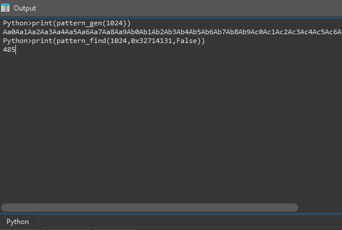

# ida-pattern-generator (xchgll_pattern.py)

Very simple script to generate patteron for overflows and finding offsets

compatible with metasploit generator `msf-pattern_create` 

## Setps to use

1. Press ALT + F7
2. Select the script
3. Enjoy : )

## Exported Functions

1. **`pattern_gen(length: pattern length)`**
2. **`pattern_find(length: pattern length,match: eip,is64: False by default)`**